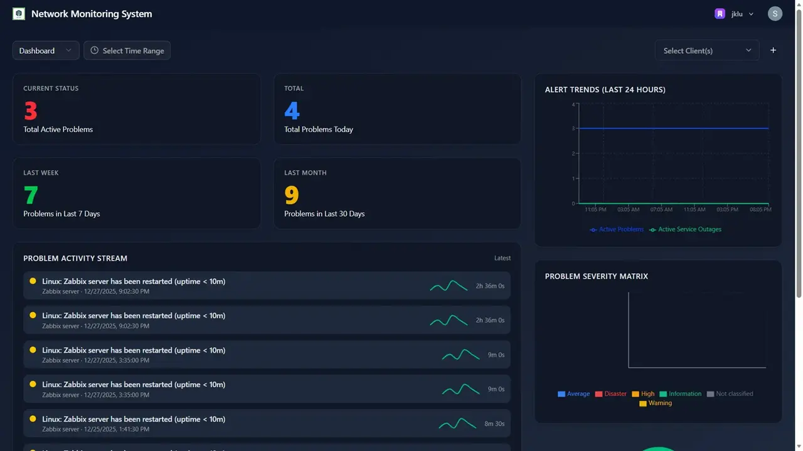
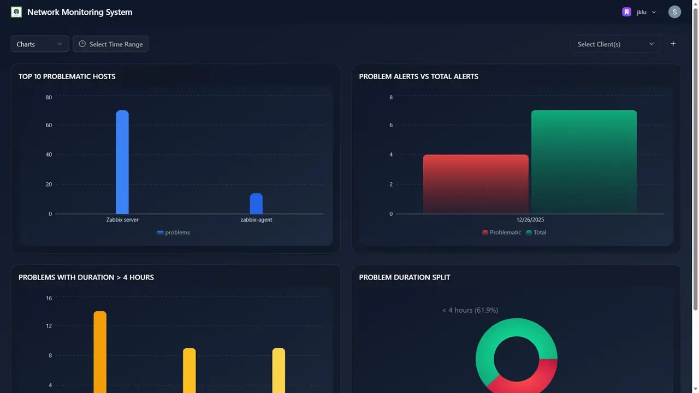
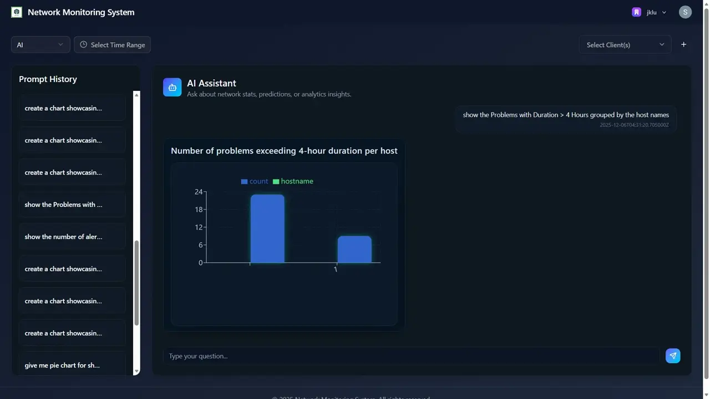
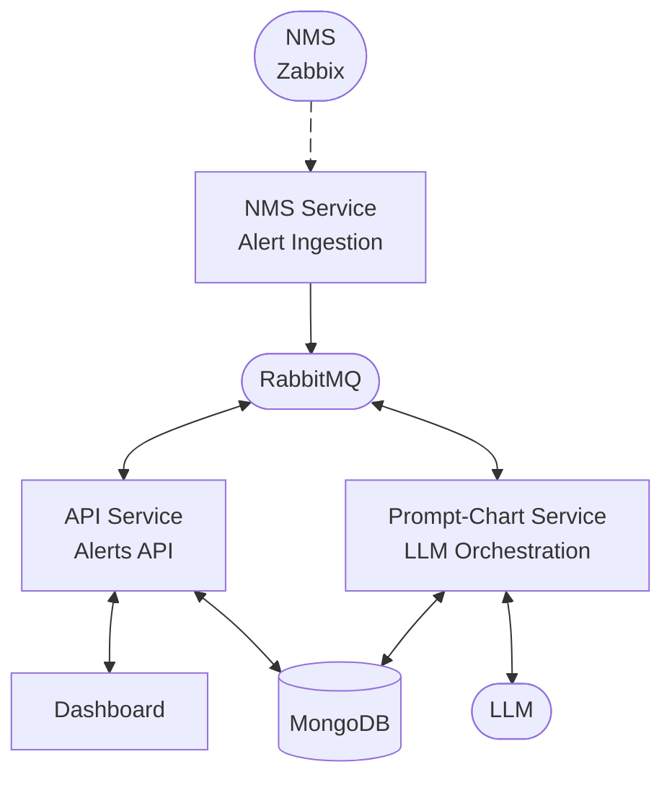

# Intelligent Network Status Analysis System using NMS Data, Interactive Dashboard, and LLMs

## Overview

The **Intelligent Network Status Analysis System** is a microservices-based platform designed to ingest alerts and telemetry data from a Network Management System (NMS) such as **Zabbix**, analyze and store them efficiently, and present actionable insights through an **interactive real-time dashboard**.

The system integrates **Large Language Models (LLMs)** to interpret alerts, manage analytical workflows, and generate human-readable summaries and insights for network administrators.

### Key Objectives

- Ingest and aggregate network alerts and telemetry data from Zabbix.
- Store structured and semi-structured alert data efficiently.
- Enable real-time visibility into network status via an interactive dashboard.
- Integrate LLMs to:
  - Interpret and summarize network alerts
  - Assist in automated analytics and reasoning
  - Maintain conversational context over alert data
- Enable proactive detection of downtimes and performance degradation.
- Provide a containerized local development setup using Docker.

### Screenshots





### System Architecture



#### Services Overview

1. **NMS Service**
   - Ingests alerts from **Zabbix**
   - Normalizes and saves alert data
   - Entry point for all NMS telemetry
2. **API Service**
   - Serves processed alerts to the dashboard
   - Exposes REST APIs for alert querying
   - Main backend interface for frontend
3. **Prompt-Chart Service**
   - Manages all **LLM interactions**
   - Handles chat context and responses
   - Enables chart creation using LLM over alert data
4. **Dashboard Service**
   - Web-based monitoring UI
   - Displays alerts, trends, and LLM interface
   - Communicates with backend APIs

#### Repository Structure

```md
.
├── .env.sample
├── docker-compose.yml
├── README.md
│
├── common/                         # Shared backend utilities
│   ├── models/                     # Shared DB models
│   ├── schemas/                    # Shared API schemas
│   ├── services/                   # Auth, DB, MQ helpers
│   └── README.md
│
├── nms/                            # Alert ingestion service
│   ├── main.py                     # Ingestion API entry point
│   ├── src/
│   │   ├── routes/
│   │   │   └── zabbix.py           # Zabbix webhook endpoints
│   │   ├── templates/              # Alert & service templates
│   │   ├── middlewares/            # Client validation
│   │   ├── utils.py                # Helper utilities
│   │   └── config.py               # Service configuration
│   ├── Dockerfile
│   └── README.md
│
├── api/                            # Alerts API service
│   ├── main.py                     # FastAPI entry point
│   ├── src/
│   │   ├── routes/                 # REST API routes
│   │   │   ├── alerts/             # Alert-related endpoints
│   │   │   ├── sse.py              # Server-Sent Events
│   │   │   └── promptChart.py      # LLM-related API hooks
│   │   ├── middlewares/            # Auth & request middleware
│   │   ├── schemas.py              # Request/response schemas
│   │   └── config.py               # Service configuration
│   ├── Dockerfile
│   └── README.md
│
├── promptChart/                    # LLM orchestration service
│   ├── main.py                     # LLM API entry point
│   ├── src/
│   │   ├── agent_x/                # Core LLM agent logic
│   │   │   ├── agent.py
│   │   │   └── tools/              # MongoDB & response tools
│   │   ├── routes/                 # LLM & thread APIs
│   │   ├── models/                 # Local / cloud LLM adapters
│   │   ├── middlewares/            # Logging & validation
│   │   ├── schemas.py              # LLM schemas
│   │   └── config.py               # Service configuration
│   ├── Dockerfile
│   └── README.md
│
├── dashboard/                      # React frontend
│   ├── src/
│   │   ├── pages/                  # App pages (Dashboard, Login)
│   │   ├── components/             # Reusable UI components
│   │   │   ├── dashboard/            # Dashboard widgets & KPIs
│   │   │   ├── charts/               # Data visualizations
│   │   │   ├── ai/                   # LLM-driven UI components
│   │   │   └── ui/                   # Shared UI primitives
│   │   ├── hooks/                  # SSE & UI hooks
│   │   ├── services/               # API clients
│   │   ├── stores/                 # Global state
│   │   └── utils/                  # Frontend utilities
│   ├── public/                     # Static assets
│   ├── Dockerfile
│   └── README.md
│
└── zabbix/                         # Zabbix local setup & tooling
```

## Setup

1. Install **Docker**
2. Install **LM Studio**
3. Download **gpt-oss-20b** model in LM Studio
4. Start **OpenAI-compatible API server** in LM Studio
5. Create a `.env` file similar to the [`.env.sample`](./.env.sample) file and configure required variables
6. Start all services:

   ```bash
   docker compose up -d
   ```

### Accessing the Application

- **Dashboard**
  [http://localhost:5173](http://localhost:5173)
- **API Documentation**
  - Alerts API: [http://localhost:5000/docs](http://localhost:5000/docs)
  - NMS Ingestion API: [http://localhost:2442/docs](http://localhost:2442/docs)
  - LLM Integration API: [http://localhost:4200/docs](http://localhost:4200/docs)

### Zabbix Setup

1. Visit the Dashboard.
2. Login
3. Add a new Client
4. Follow the Zabbix Setup Instructions

## Current Limitations

- Batch-based Zabbix ingestion
- Prototype-level analytics

## Future Enhancements

- Real-time streaming ingestion
- LLM-driven root cause analysis

## Contributors

- Rajat Paliwal (2022BTech081)
- Swastik Kulshreshtha (2022BTech105)
- Utkarsh Tailor (2022BTech106)

**Project Supervisor**: Dr. Devika Kataria
